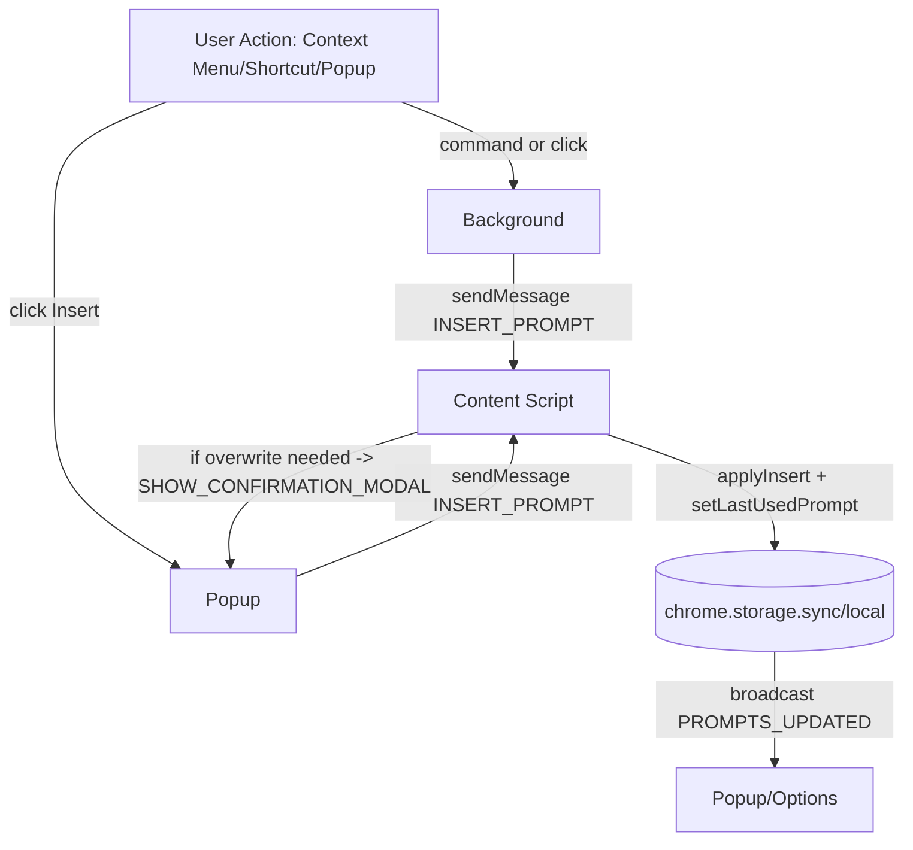

# AI Studio Prompt Library — Architecture (As‑Is v0.2)

Version: 0.2

## Change Log

| Date       | Version | Description                      | Author            |
|------------|---------|----------------------------------|-------------------|
| 2025-09-03 | 0.2     | Initial architecture from map    | BMad Orchestrator |

## Overview

Purpose: Chrome MV3 extension to save and insert reusable System Prompts on Google AI Studio.

Architecture style: MV3 background service worker + content script + popup and options UIs, with shared storage and messaging.

Source tree: [docs/architecture/source-tree.md](docs/architecture/source-tree.md)

## Components

- Background Service Worker: [extension/src/background/index.ts](extension/src/background/index.ts). Initializes storage, builds context menus, handles commands, sends insert messages.
- Content Script: [extension/src/content/index.ts](extension/src/content/index.ts). Detects System instructions field, optional confirm modal, applies insert, auto-open/close panel.
- Popup UI: [extension/src/popup/index.html](extension/src/popup/index.html), [extension/src/popup/main.ts](extension/src/popup/main.ts). Search/filter, Insert, Copy, closes on success.
- Options UI: [extension/src/options/index.html](extension/src/options/index.html), [extension/src/options/main.ts](extension/src/options/main.ts). CRUD prompts, settings, import/export.
- Shared Storage and Types: [extension/src/shared/storage.ts](extension/src/shared/storage.ts), [extension/src/shared/types.ts](extension/src/shared/types.ts).
- Messaging Contracts: [extension/src/shared/messages.ts](extension/src/shared/messages.ts).
- Chrome Helpers: [extension/src/shared/chrome-utils.ts](extension/src/shared/chrome-utils.ts).
- UI Utilities and Styles: [extension/src/shared/ui-utils.ts](extension/src/shared/ui-utils.ts), [extension/src/shared/ui.css](extension/src/shared/ui.css).
- Manifest: [extension/manifest.json](extension/manifest.json). Declares permissions, background, scripts, commands.

## Technology Stack

| Category      | Technology                      | Version | Usage |
|---------------|----------------------------------|---------|-------|
| Language      | TypeScript                       | ^5.5.4 | All modules |
| Build         | Vite + @crxjs/vite-plugin        | ^5.4.0 / ^2.2.0 | MV3 bundling |
| Runtime       | Chrome Extension MV3             |  | Background, Popup, Options, Content |
| Types         | chrome-types                     | ^0.1.266 | Chrome typings |

## Permissions and Scripts

- Permissions: storage, activeTab, contextMenus (scoped via content_scripts matches). See [extension/manifest.json](extension/manifest.json).
- Content script match: https://aistudio.google.com/*.
- Commands: open_palette, insert_last_prompt with default hotkeys.

## Data Model

- Prompt: id, name, content, tags?, favorite?, createdAt, updatedAt. See [extension/src/shared/types.ts](extension/src/shared/types.ts).
- Settings: insertMode, showContextMenu, theme, confirmOverwriteSystem, confirmDeletePrompt?, autoClosePanel?, customSelector?. See [extension/src/shared/types.ts](extension/src/shared/types.ts).
- Storage layout: prompts in chrome.storage.local under prefix prompt_; settings + lastUsedPromptId in chrome.storage.sync. Implemented in [extension/src/shared/storage.ts](extension/src/shared/storage.ts).

## Messaging

- RuntimeMessage union in [extension/src/shared/messages.ts](extension/src/shared/messages.ts): INSERT_PROMPT, PROMPTS_UPDATED, SHOW_CONFIRMATION_MODAL.
- Background and Popup send INSERT_PROMPT to Content; Content sets last used and applies insertion.
- Storage broadcasts PROMPTS_UPDATED with detail for efficient UI refresh.
- Content asks Popup to close before showing modal via SHOW_CONFIRMATION_MODAL.

### Message Flow Diagram

## Storage Strategy

- Avoid chrome.storage.sync per-item quotas by storing prompts in local; keep settings in sync for cross-device behavior.
- Upserts preserve createdAt; deletions re-point lastUsedPromptId to first remaining prompt.
- Import guards against destructive empty imports unless force flag is used.

## Build and Deployment

- Build with pnpm build (or npm run build). Output dist/ for Load unpacked.
- Dev with pnpm dev to run Vite dev server for MV3 HMR via @crxjs.
- See [README.md](README.md) for full steps.

## Constraints and Decisions

- No tabs permission; rely on activeTab and explicit user gesture.
- Content script limited to aistudio.google.com; no dynamic code injection.
- Privacy-by-design: no external network access; all data stays local.
- Resilience: multiple DOM selectors + user-provided customSelector escape hatch.

## Risks and Mitigations

- DOM drift on AI Studio could break selector assumptions → Mitigation: layered selectors, custom selector, toast error.
- Context menu duplication during hot reload → Mitigation: rebuild lock + duplicate id tolerance in [extension/src/shared/chrome-utils.ts](extension/src/shared/chrome-utils.ts).
- Storage quota limits if prompts grow very large → Mitigation: local storage, optional export/import.

## Testing Strategy (Proposed)

- Unit tests for [extension/src/shared/storage.ts](extension/src/shared/storage.ts) and [extension/src/shared/ui-utils.ts](extension/src/shared/ui-utils.ts).
- E2E tests with Playwright: emulate AI Studio DOM to validate insertion flows.
- Manual smoke: commands, context menus, insertion modes.

## Next Steps

- Add automated tests and minimal CI.
- Consider prompt tags/favorites and quick filters.
- Enhance error surfaces and diagnostics without telemetry.